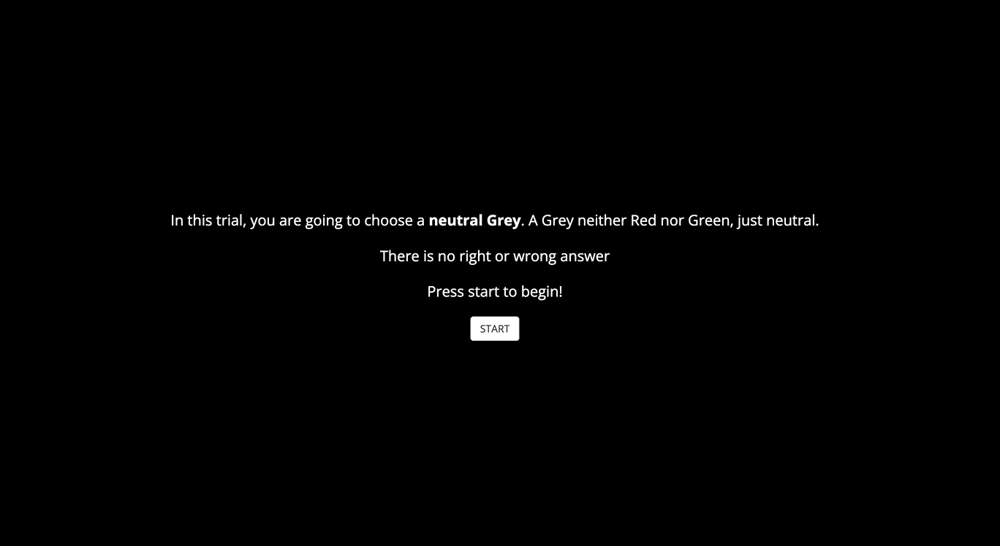
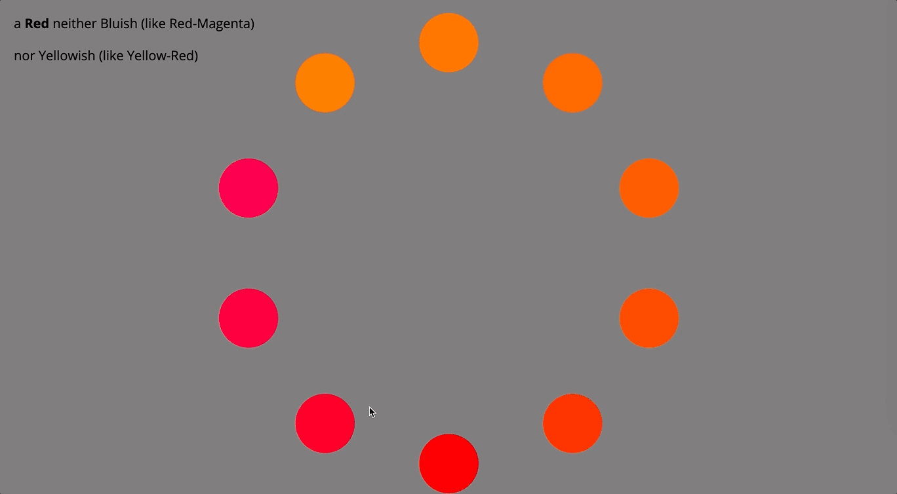

# GUI to perform hue judgments & Calibration method

[The Pitch](#the-pitch) $\cdot$ [Usage](#usage) $\cdot$ [References](#references)

<em>The [document](./documents/) folder contains detailed information about the designed graphical user interface and the calibration method.</em>

## The Pitch

Graphical user interface to determine unique hues or "pure" hues. Such as a red neither bluish nor yellowish.  

This GUI is implemented using the library [jsPsych](https://www.jspsych.org/7.3/) to make it avaiable for every computer display device. jsPysch can be run online and it is supported by [Pavlovia](https://pavlovia.org/#main) (site created to easily run experiments online).

The stimulus shown formed an annulus of 10 selectable patches in a ordered fashion arrangement. The observer selected the target stimulus by a mouse press on the patch. Once the patch was selected, the next trial automatically started.

The experiment is divided into two stages: **neutral background** and **hue selections**. In the neutral background stage (1) is selected the neutral grey of the specific display device. These color coordinates are saved and set as background during the hue selections stage (2). 

After the hues have been collected, the HSV values can be input to compute the **calibration method** ([Calibration_Method](./Calibration_Method/)) between a reference and a test display. 

## GUI usage

To run the software, first add the folder [jspsych-psychophysics/](https://github.com/kurokida/jspsych-psychophysics), and the file [colorconversion.js](https://bottosson.github.io/posts/colorpicker/) to the root folder [GUI_Calibration/](../GUI_Calibration/) (GUI_Calibration/jspsych-psychophysics/). 

The hue shifts of the stimuli are avaiable in [Okhsv](https://bottosson.github.io/posts/colorpicker/) ([exp_unique_hues.html](./Hue_Judgments/exp_unique_hues.html)). Compared with other device-dependent color spaces such as HSV, Okhsv is derived from color perception experiments being a more homogeneous color space.

After the GUI is set up, you can use it by open it with a web browser. Note that you have to consider the color management processes on the web browser to fully control the color displayed. [Color Management for Your Web Browsers](https://www.benq.com/en-us/knowledge-center/knowledge/web-browsers-color-management.html) and [Color Management for Creators - Web Browser Edition](https://www.eizoglobal.com/library/management/web-color-management/) for more detailed information. 

### Survey & Instructions

The experiment starts with a short survey that includes relevant user information for handling the data. The answers are saved, and they are displayed after the experiment is completed. After the survey, appear the necessary instructions to complete the experiment.

### Neutral Background

Since the assumption that the same proportion of the R, G, and B channels produces neutral grey is not necessarily correct for an uncalibrated device (Karatzas and Wuerger, 2007), and the color appearance depends on the surrounding colors, it is essential to define an achromatic background.

The achromatic background is first determined by shifting the hue along the red–green axes in HSV. The selected RGB coordinates appear in the new annulus and the new hue angles are calculated according to de previous selection and along yellow-blue axes in HSV. 

### Hue selections

In the second stage of the experiment, the interface adopted was similar to the neutral background trial. However, in this case, the main purpose is to make hue selections. This step can include judgments over different hues, for example, red, green, blue, yellow, and orange. We could set the instructions as follows:

* Red: neither Bluish (like Red-Magenta) nor Yellowish (like Yellow-Red).
* Green: neither Yellowish (like Green-Yellow) nor Bluish (like Cyan-Green).
* Blue: neither Greenish (like Cyan-Green) nor Reddish (like Magenta-Blue).
* Orange: Orange: neither Reddish (like Red) nor Yellowish (like Yellow).
* Yellow: neither Greenish (like Green-Yellow) nor Reddish (like Yellow-Red)

## Calibration method

The hue selection stage collects the hue judgments to be used to define the hue planes in a psychologically-defined three-dimensional color space. Then, this hue judgments data is used to create the display profile, which characterizes its color behavior. 

A matrix can be applied to transform the linear user-RGB coordinates into the linear reference-RGB ones. The matrix-based transformations are computed using the information contained in two display profiles, one from the test and the other from the reference displays. Next, this transformation is applied to adjust the linear RGB values from the user display to match the reference color appearance.

To execute the method add the files in [additional_functions/](./Calibration_Method/additional_functions/) to the root folder [GUI_Calibration/](../GUI_Calibration/). 

### Files and functionality

* [color_data.m](./Calibration_Method/color_data.m): preprocess the color data before computing the matrix-based transformation to perform the calibration method. Here are added the hue responses from the experiments. 
* [hsvtorgb.m](./Calibration_Method/hsvtorgb.m): convert HSV color space into RGB color space. 
* inverse_hue.m: calculates the symmetrical angle with respect to the expected hue angle in the HSV color space.
* [Measure_patch_T.m](./Calibration_Method/Measure_patch_T.m): plots a number of color patches after computing the transformation over input RGB values. The patches are shown with a delay of 0.5s. 
* [Measure_patch.m](./Calibration_Method/Measure_patch.m): Plots a number of color patches given their input RGB values. The patches are shown with a delay of 0.5s. 
* [Normal_plane.m](./Calibration_Method/Normal_plane.m): computes the normals of the R, G and B planes by performing the plane fitting using the 3D points of each plane.
* [patch_imshow.m](./Calibration_Method/patch_imshow.m): displays a color patch given RGB as input. 
* [patch_T.m](./Calibration_Method/patch_T.m): displays a color patch after compute the matrix-based transformation T over input RGB values.

### Matrix-Based Transformations
There are three types of matrix-based transformations to calibrate a user display to math a reference display. 

* [T_point2point_fminsearch.m](./Calibration_Method/T_point2point_fminsearch.m): computes the transformation T_final which maps the linear reference-RGB points into the linear user-RGB points. This transformation is computed finding the minimum of unconstrained multivariable function using derivative-free method from point to point. 

$$\begin{equation}
    \begin{bmatrix}
    r^{lin}\\ g^{lin}\\ b^{lin}
    \end{bmatrix}_{ref}^T
    =  
    \begin{bmatrix}
    r^{lin}\\ g^{lin}\\ b^{lin}
    \end{bmatrix}_{user}^T
    \cdot
    \begin{bmatrix}
    t_{11} & t_{12} & t_{13}\\
    t_{21} & t_{22} & t_{23}\\ 
    t_{31} & t_{32} & t_{33}\\ 
    \end{bmatrix}
\end{equation}$$

* [T_optimization_plane.m](./Calibration_Method/T_optimization_plane.m): computes the transformation T_final which maps the linear reference-RGB points into their correspondent hue planes in the linear user-RGB space. The transformation is obtained minimizing the distance between the linear reference-RGB points and the hue planes in the linear user-RGB space by performing a constrained optimization. 
  
$$
\begin{equation}
    \begin{bmatrix}
    r^{lin}_h & g^{lin}_h & b^{lin}_h
    \end{bmatrix}_{ref}
    \cdot \begin{bmatrix}
    t_{11} & t_{12} & t_{13}\\
    t_{21} & t_{22} & t_{23}\\ 
    t_{31} & t_{32} & t_{33}\\ 
    \end{bmatrix} \cdot 
    \begin{bmatrix}
    \alpha^{lin}_h\\
    \beta^{lin}_h\\
    \gamma^{lin}_h
    \end{bmatrix}_{user} = 0
\end{equation}
$$

* [T_white.m](./Calibration_Method/T_white.m): computes the transformation T_final which maps the linear reference-RGB points into their correspondent hue planes in the linear user-RGB space. The transformation is obtained minimizing the distance between the linear reference-RGB points and the hue planes in the linear user-RGB space by performing a constrained optimization. 

$$
\begin{equation}
    \begin{bmatrix}
    r^{lin}\\ g^{lin}\\ b^{lin}
    \end{bmatrix}_{ref, grey}^T
    =  
    \begin{bmatrix}
    r^{lin}\\ g^{lin}\\ b^{lin}
    \end{bmatrix}_{user, grey}^T
    \cdot
    \begin{bmatrix}
    t_{11} & t_{12} & t_{13}\\
    t_{21} & t_{22} & t_{23}\\ 
    t_{31} & t_{32} & t_{33}\\ 
    \end{bmatrix}
\end{equation}
$$

## References

You can find the references in the folder [documents](./documents/).

